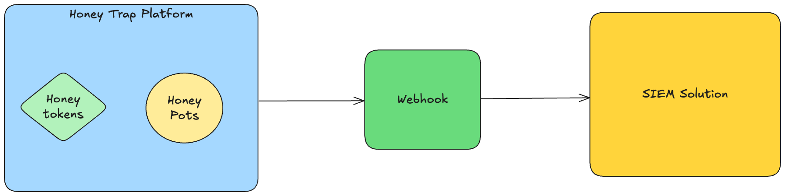
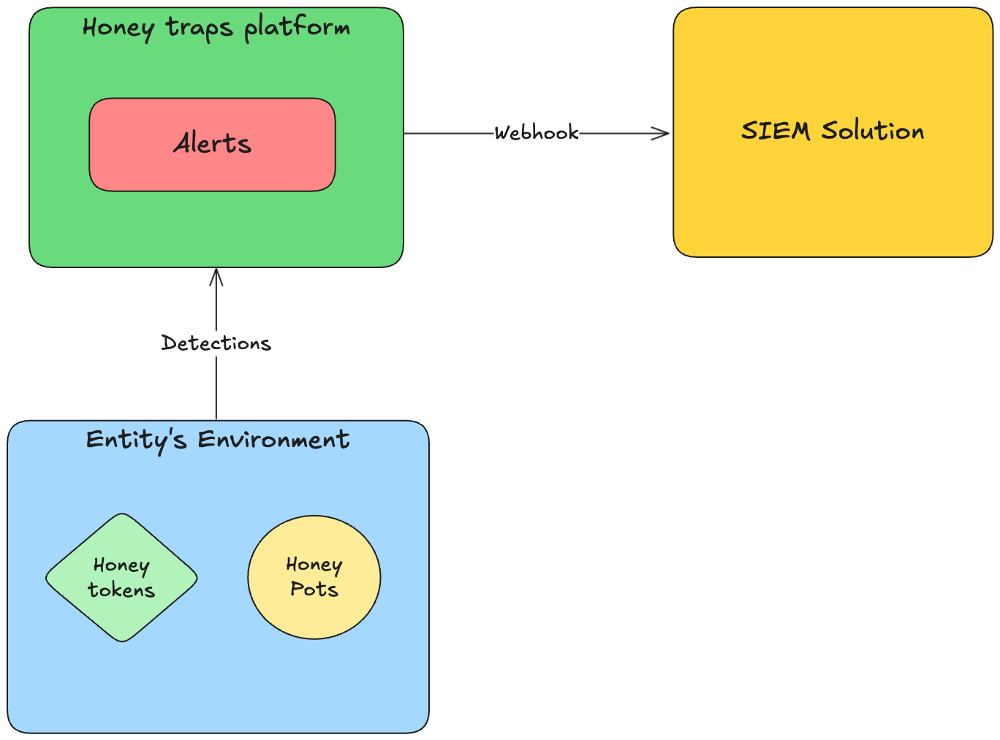
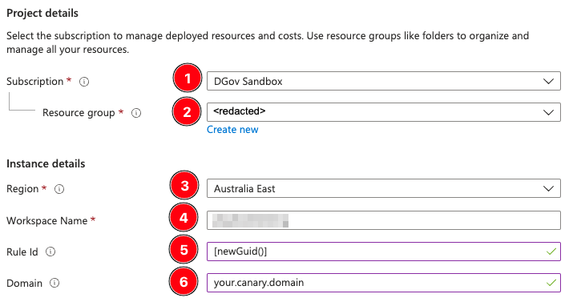

<!-- BEGINNING: Intro -->
# WA HoneyTraps Program
This repository contains information on the WA Honey Traps Program onboarding process and a technical onboarding guide to assist with the technical integration of the Honey Trap platform.

## Table of Contents

1) [Platform Integration - Overview](#platform-integration---overview)

2) [Onboarding Checklist](#onboarding-checklist)

3) [Azure Logic App Deployment Guide](#azure-logic-app-deployment-guide)

4) [Analytic Rules Deployment Guide](#analytic-rules-deployment-guide)

5) [Initiating an end-to-end test](#initiating-an-end-to-end-test)

6) [Feedback](#feedback-1)

---

<!-- ) -->
## Platform Integration - Overview

## Onboarding Checklist

- [ ] Refer to information and instructions provided in [WASOC Honey Trap (Pilot)](https://soc.cyber.wa.gov.au//onboarding/honey-traps/) get onboard to WA Honeytraps Program.
- [ ] Verify that a Canary group has been provisioned for agency by WA SOC.
- [ ] Deploy integration webhook logic-apps [Azure Logic App Deployment Guide](#azure-logic-app-deployment-guide)
- [ ] Deploy analytic rules for Microsoft Sentinel [Analytic Rules Deployment Guide](#analytic-rules-deployment-guide)
- [ ] Ensure analytic rules and Logic Apps have been enabled
- [ ] [Initiate end-to-end test to generate alert](#initiating-an-end-to-end-test)

## Feedback
For questions or feedback, please contact cybersecurity@dpc.wa.gov.au

 
<!-- Empty line for styling -->
 

 
<!-- Empty line for styling -->
 

<!-- END: Intro -->

---

<!-- BEGINNING: Data Collection Rule and Custom Table creation ARM template deployment guide -->

# Data Collection Rule creation and Logic App deployment guide
The following steps will guide you on utilising Azure ARM templates to create a Data Collection Rule and a custom table for the canary platform data.

## Pre-requisites:
- Requires an Azure Log Analytics Workspace (to ingest the data from Canary platform)
- A Canary group that has been provisioned by WASOC

## Step by step guide

### Step 1. 
To start the deployment of the logic app to Azure, click on the Deploy to 'Azure button' shown below.

### Step 2.
You will be redirected to the custom deployment screen in azure portal. Select/ fill-in the required information.

Field description:
1. **Subscription**: The subscriptions where the Data Collection Rules will be deployed to.
2. **Resource Group**: The resource group where the Data Collection Rules will be deployed to.
3. **Data Collection Rule Name**: Name for the Data Collection Rule (Note: No special characters or numbers).
4. **Workspace Resource ID**: The Workspace Resource ID of the log analytics workspace, where the canary/ canary-token logs will be send to.
5. **Workspace Name**: The name of the Workspace you have selected above.

> Note: Workspace Resource ID can be found under the settings of the workspace in Sentinel.

### Step 3.
Review and ensure all details provided in the deployment are correct and proceed with creating the resources. Otherwise, select the 'previous' button to go back and make any changes.

### Step 4.
Click on the Data Collection Rule resource that was just deployed and in the overview of the DCR, select JSON View on the top right hand corner. 

### Step 5. 
Now select the 'Deploy to Azure' to deploy the Logic Apps for sending the Canary data over to the Log Analytic workspace and fill in the following information.

Field description:
1. **Subscription**: The subscriptions where the Logic apps will be deployed to.
2. **Resource Group**: The resource group where the Logic apps will be deployed to.
3. **Logic App Name**: Name for the Logic App.
4. **DCR Immutable ID**: DCR Immutable ID from the previously deployed DCR (from the JSON view).
5. **DCR Log Ingestion**: DCR Log Ingestion URI from the previously deployed DCR (from the JSON view).

 
<!-- Empty line for styling -->
 

 
<!-- Empty line for styling -->
 

---

<!-- BEGINNING: Analytic Rules Deployment Guide -->

# Analytic Rules Deployment Guide

The following steps will guide you on deploying analytic-rules to generate alerts and incident in your Microsoft Sentinel workspace.

## Prerequisites

- You must have set up [send-canary-alert-webhook](#azure-logic-app-deployment-guide) logic-apps prior to deploying the analytic rules
- You must have atleast one Canary token incident generated on the Canary platform (Ref: [Step 8](#step-8) of Azure Logic App Deployment Guide)
- The analytic rule uses the following default table name in your Log Analytics Workspace: **CanaryLogs_CL**

## Step by step guide

### Step 1.

To start the deployment of the Azure Analytic Rules for each type of canary, click on the 'Deploy to Azure' buttons shown below.

| Rule | Deploy |
|-|-|
| **Canary Tokens - Analytic Rules** |  | 
| **Canary - Analytic Rules** |  | 
| **Threat Intelligence - Honey Traps - Suspicious Sign-in** |  | 

### Step 2.

> Note: Please deploy each analytic rule template one at a time.

You will be redirected to the custom deployment screen in azure portal. Select/ fill-in the required information

Field description:
1. **Subscription**: The subscriptions where the Sentinel workspace is located
2. **Resource Group**: The resource group where the Sentinel workspace is located
3. **Region**: The region where the Sentinel workspace is located
4. **Workspace Name**: The _workspaceName_ of Sentinel log analytics workspace, where the analytic rule will be deployed to
5. **Rule Id**: Value to obtain a new Rule Id using the newGuid function in Azure
6. **Domain**: The domain name for the canary platform, to be provided by WASOC.

> Note: Do not replace or change the value in the 'Rule Id' field, this is to generate unique Id for your analytic rules.

### Step 3.
Review and ensure all details provided in the deployment are correct and proceed with creating the resources. Otherwise, select the 'previous' button to go back and make any changes.

### Step 4.
Navigate to _Analytics_ blade inside the Microsoft Sentinel, and verify that the analytics rules has been created and enabled.

### Step 5.
Initiate test to generate incident from the canary platform, and verify that incidents were generated in Microsoft Sentinel.
<!-- END: Analytic Rules Guide -->

## Initiating an end-to-end test
To initiate an end-to-end test the integration of the canary platform and the SIEM, you could do the following.

### Pre-requisites
- You must have a canary group provisioned by WA SOC.
- You must have completed the [Azure Logic App Deployment](#azure-logic-app-deployment-guide) and have the [Analytic Rules Deployed](#analytic-rules-deployment-guide).

### Step 1. 
Create a new canary token within your canary group.

### Step 2. 
Trigger the canary token by interacting with it.

### Step 3. 
Navigate to your Log Analytics Workspace to check if any alerts have been ingested.
> It may take up to 5 minutes for the alerts to ingest

If you have alerts being ingested into your Log Analytics Workspace, you have successfully completed your canary platform and SIEM integration. 

## Feedback
For questions or feedback, please contact cybersecurity@dpc.wa.gov.au

 
<!-- Empty line for styling -->
 

 
<!-- Empty line for styling -->
 
