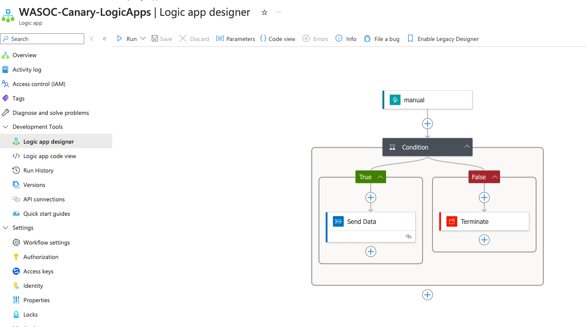
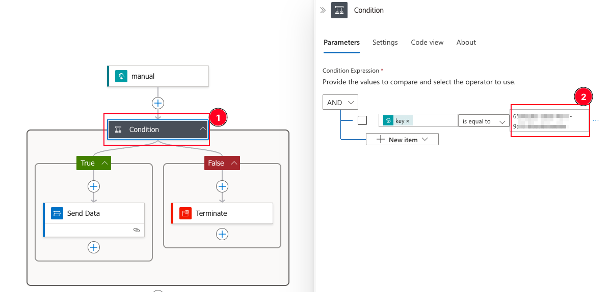

<!-- BEGINNING: Intro -->
# WA HoneyTraps Program
This site contains technical information to onboard to WA HoneyTraps program.

## Table of Contents

1) [Onboarding Checklist](#onboarding-checklist)

2) [Azure Logic App Deployment Guide](#azure-logic-app-deployment-guide)

3) [Analytic Rules Deployment Guide](#analytic-rules-deployment-guide)

4) [Initiating an end-to-end test](#initiating-an-end-to-end-test)

5) [Feedback](#feedback-1)

---

## Onboarding Checklist

- [ ] Refer to information and instructions provided in [WASOC Honey Trap (Pilot)](https://soc.cyber.wa.gov.au//onboarding/honey-traps/) get onboard to WA Honeytraps Program.
- [ ] Verify that a Canary group has been provisioned for agency by WA SOC.
- [ ] Deploy integration webhook logic-apps [Azure Logic App Deployment Guide](#azure-logic-app-deployment-guide)
- [ ] Deploy analytic rules for Microsoft Sentinel [Analytic Rules Deployment Guide](#analytic-rules-deployment-guide)
- [ ] Ensure analytic rules and Logic Apps have been enabled
- [ ] [Initiate end-to-end test to generate alert](#initiating-an-end-to-end-test)

## Feedback
For questions or feedback, please contact cybersecurity@dpc.wa.gov.au
<!-- END: Intro -->

---

<!-- BEGINNING: Azure Logic App Deployment Guide -->
# Azure Logic App Deployment Guide

The following steps will guide you on utilising Azure ARM templates to deploy logic-app resource(s) to send canary alerts from the canary platform to the agency's Sentinel workspace.

## Pre-requisites:
- Requires an Azure Log Analytics Workspace (to ingest the data from Canary platform)
- Required permissions to deploy the logic app and resources
- A Canary group that has been provisioned by WASOC

## Step by step guide

### Step 1. 
To start the deployment of the logic app to Azure, click on the Deploy to 'Azure button' shown below.

### Step 2.
You will be redirected to the custom deployment screen in azure portal. Select/ fill-in the required information.

Field description:
1. **Subscription**: The subscriptions where the Logic apps will be deployed to
2. **Resource Group**: The resource group where the Logic apps will be deployed to
3. **Log Analytics Workspace ID**: The _workspaceId_ of Sentinel log analytics workspace, where the canary/ canary-token logs will be send to
4. **Log Analytics Workspace Key**: The _primary key_ of the agent for Sentinel log analytics workspace, where the canary/ canary-token will be send to

> Note: Do not replace or change the value in the 'Unique Key' field as this will be used to generate a unique key for the webhook header.

Reference: 
- [Where is azure workspace Id and primary key](https://learn.microsoft.com/en-us/answers/questions/1154380/where-is-azure-is-the-primary-key-and-workspace-id)

### Step 3.
Review and ensure all details provided in the deployment are correct and proceed with creating the resources. Otherwise, select the 'previous' button to go back and make any changes.

### Step 4.
Navigate to your resource group from the deployment details page, and select your deployed Logic App (containing the name that you provided in the Step 2).

Your deployed Logic App under the Logic App designer, should look similar to the image shown below.

Capture the following information from your Logic App deployment for setting up a webhook with the Canary platform.

### Step 5.

1. Select the 'manual' action on the Logic App.
2. Copy/note down the value under the '**HTTP URL**' section, as shown below.

### Step 6.

1. Select the 'Condition' action from the Logic App.
2. Copy/note down the '**key**' value in the right side of the 'is equal to' condition. (***This is a GUID that is unique to you and will be used in setting up the webhook with the Canary platform***)

<!-- The two pieces of information noted in the previous steps 5 and 6 will be required to complete the setup of the webhook on the Canary platform side, which will allow you to start ingesting the alerts from the Canary platform to your Log Analytics Workspace. -->

### Step 7.

Provide the two pieces of information collected in Step 5 and Step 6 to the WASOC team for completing the integration of the Canary platform with your Sentinel environment.
1. *Webhook URL* from Step 5
2. *GUID value* from Step 6
<!-- Navigate to your Canary platform's webhook settings and enter the two pieces of information we collected earlier as shown in the image below.

Field description:

1. Paste the URL from the logic app copied in the step 5.
2. Provide a header name and paste the GUID value copied in step 6.
3. Save the webhook information.

This completes the integration of your Canary platform with your SIEM environment. -->

<!-- END: Azure Logic App Deployment Guide -->
---
<!-- BEGINNING: Analytic Rules Deployment Guide -->
# Analytic Rules Deployment Guide

The following steps will guide you on deploying analytic-rules to generate alerts and incident in your Microsoft Sentinel workspace.

## Prerequisites

- You must have set up [send-canary-alert-webhook](#azure-logic-app-deployment-guide) logic-apps prior to deploying the analytic rules
- The analytic rule uses the following default table name: **CanaryLogs_CL**

## Step by step guide

### Step 1.

To start the deployment of the Azure Analytic Rules for each type of canary, click on the 'Deploy to Azure' buttons shown below.

|  **Canary Tokens - Analytic Rules** | |
|-|-|
| **Canary - Analytic Rules** |  |

### Step 2.

> Note: Please deploy each analytic rule template one at a time.

You will be redirected to the custom deployment screen in azure portal. Select/ fill-in the required information

Field description:
1. **Subscription**: The subscriptions where the Sentinel workspace is located
2. **Resource Group**: The resource group where the Sentinel workspace is located
3. **Region**: The region where the Sentinel workspace is located
4. **Workspace Name**: The _workspaceName_ of Sentinel log analytics workspace, where the analytic rule will be deployed to
5. **Rule Id**: Value to obtain a new Rule Id using the newGuid function in Azure
6. **Domain**: The domain name for the canary platform, to be provided by WASOC.

> Note: Do not replace or change the value in the 'Rule Id' field, this is to generate unique Id for your analytic rules.

### Step 3.
Review and ensure all details provided in the deployment are correct and proceed with creating the resources. Otherwise, select the 'previous' button to go back and make any changes.

### Step 4.
Navigate to _Analytics_ blade inside the Microsoft Sentinel, and verify that the analytics rules has been created and enabled.

### Step 5.
Initiate test to generate incident from the canary platform, and verify that incidents were generated in Microsoft Sentinel.
<!-- END: Analytic Rules Guide -->

## Initiating an end-to-end test
To initiate an end-to-end test the integration of the canary platform and the SIEM, you could do the following.

### Pre-requisites
- You must have a canary group provisioned by WA SOC.
- You must have completed the [Azure Logic App Deployment](#azure-logic-app-deployment-guide) and have [Analytic Rules Deployed](#analytic-rules-deployment-guide).

### Step 1. 
Create a new canary token within your canary group.

### Step 2. 
Trigger the canary token by interacting with it.

### Step 3. 
Navigate to your Log Analytics Workspace to check if any alerts have been ingested.
> It may take up to 5 minutes for the alerts to ingest

If you have alerts being ingested into your Log Analytics Workspace, you have successfully completed your canary platform and SIEM integration. 

## Feedback
For questions or feedback, please contact cybersecurity@dpc.wa.gov.au
