<!-- BEGINNING: Intro -->
# WA HoneyTraps Program
This repository contains information on the WA Honey Traps Program onboarding process and a technical onboarding guide to assist with the technical integration of the Honey Trap platform.

## Table of Contents

1) [Platform Integration - Overview](#platform-integration---overview)

2) [Onboarding Checklist](#onboarding-checklist)

3) [Data Collection Rule and Logic App deployment guide](#data-collection-rule-and-logic-app-deployment-guide)

4) [Analytic Rules Deployment Guide](#analytic-rules-deployment-guide)

5) [Initiating an end-to-end test](#initiating-an-end-to-end-test)

6) [Feedback](#feedback-1)

---

<!-- ) -->
## Platform Integration - Overview

## Onboarding Checklist

- [ ] Refer to information and instructions provided in [WASOC Honey Trap (Pilot)](https://soc.cyber.wa.gov.au//onboarding/honey-traps/) get onboard to WA Honeytraps Program.
- [ ] Verify that a Canary group has been provisioned for agency by WA SOC.
- [ ] Complete the integrations for DCR and Logic Apps [Data Collection Rule and Logic App deployment guide](#data-collection-rule-and-logic-app-deployment-guide)
- [ ] Deploy analytic rules for Microsoft Sentinel [Analytic Rules Deployment Guide](#analytic-rules-deployment-guide)
- [ ] Ensure analytic rules and Logic Apps have been enabled
- [ ] [Initiate end-to-end test to generate alert](#initiating-an-end-to-end-test)

## Feedback
For questions or feedback, please contact cybersecurity@dpc.wa.gov.au

<!-- END: Intro -->

---

<!-- BEGINNING: Data Collection Rule and Custom Table creation ARM template deployment guide -->

# Data Collection Rule and Logic App deployment guide
The following steps will guide you on utilising Azure ARM templates to create a Data Collection Rule and Logic App to integrate Honey Traps canary platform with Microsoft Sentinel.

## Pre-requisites:
- Requires an Azure Log Analytics Workspace (to ingest the data from the Honey Traps canary platform).
- A Canary group that has been provisioned by WASOC.
- Requires Contributor permission to the Microsoft Subscription to deploy the required resources.
- Requires a minimum of 'User Access Administrator' for role assignment to the target subscription.

## Step by step guide

### Step 1. 
To start the integration of the Honey Traps platform with your Sentinel SIEM, click on the 'Deploy to Azure' button shown below. This will deploy the Data Collection Rule and Custom tables required for the integration.

### Step 2.
You will be redirected to the custom deployment screen in azure portal. Select/ fill-in the required information.

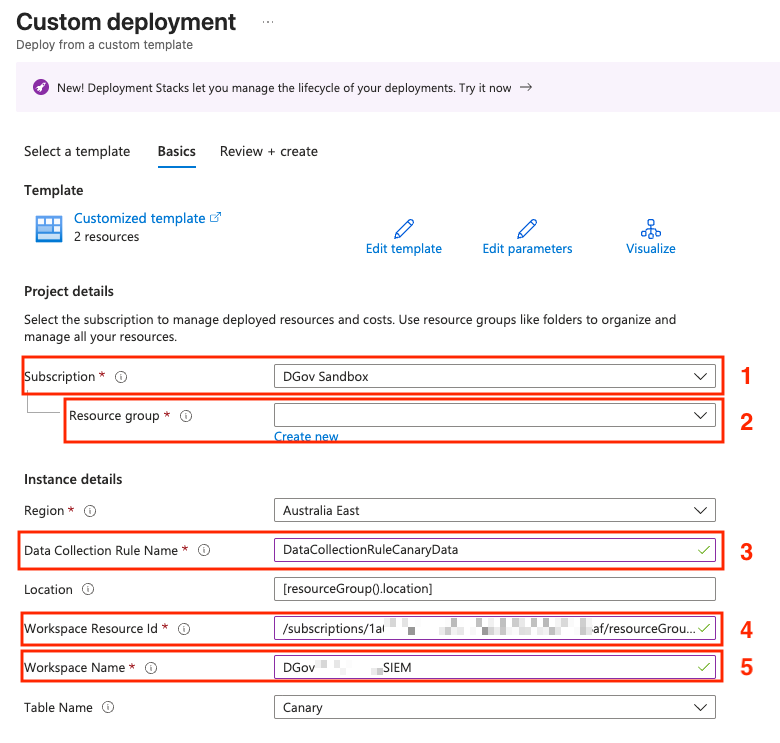

Field description:
1. **Subscription**: The subscriptions where the Data Collection Rules will be deployed to.
2. **Resource Group**: The resource group where the Data Collection Rules will be deployed to.
3. **Data Collection Rule Name**: Name for the Data Collection Rule (Note: No special characters or numbers).
4. **Workspace Resource ID**: The Workspace Resource ID of the log analytics workspace. (Microsoft sentinel > Settings > Workspace Settings > Properties > Resource ID)
5. **Workspace Name**: The name of the Workspace you have selected above.

### Step 3.
Review and ensure all details provided in the deployment are correct and proceed with creating the resources. Otherwise, select the 'previous' button to go back and make any changes.

### Step 4.
Click on the Data Collection Rule resource that was just deployed and in the overview of the DCR, select JSON View on the top right hand corner. 

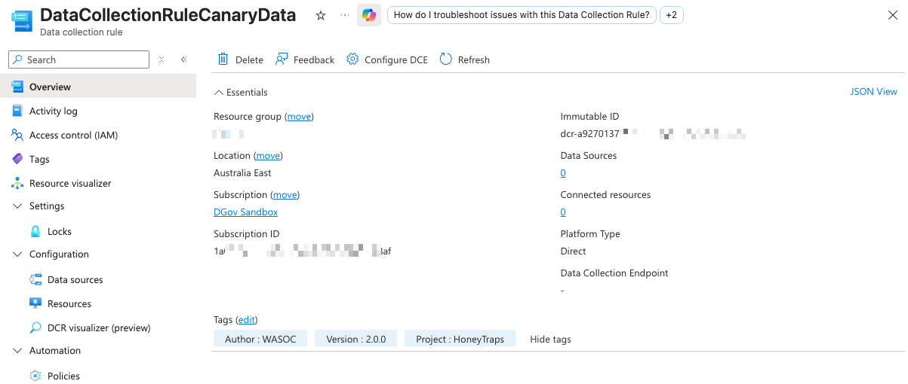

Leave this open on this tab and proceed to the next step.

### Step 5. 
Now select the 'Deploy to Azure' below and open it in a new tab to deploy the Logic Apps for sending the Canary data over to the Log Analytic workspace/datalake and fill in the following information.

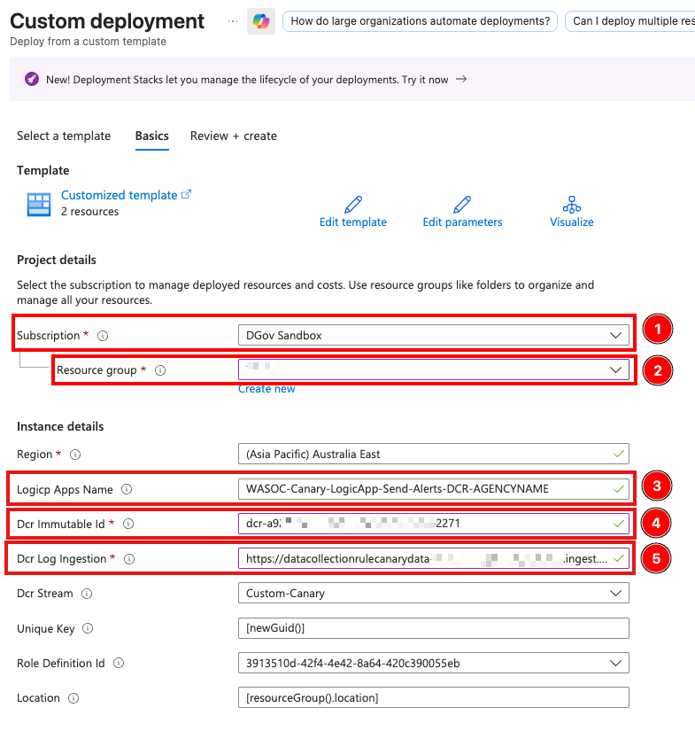

Field description:
1. **Subscription**: The subscriptions where the Logic apps will be deployed to.
2. **Resource Group**: The resource group where the Logic apps will be deployed to.
3. **Logic App Name**: The name of the Logic App. (Please update the 'AGENCYNAME' to reflect your agency's name)
4. **DCR Immutable ID**: DCR Immutable ID from the previously deployed DCR (from the JSON view).
5. **DCR Log Ingestion**: DCR Log Ingestion URI from the previously deployed DCR (from the JSON view).

{: .important }
If the DCR resource group and Logic App resource groups are different, you may need to manually assign the Monitoring Metrics Publisher role to the Managed Identity of the Logic App, scoped to the resource group that contains the Data Collection Rule (DCR).

### Step 6.

Once the information has been filled in and the resources are successfully deployed, select the deployed logic app resource (You should see a screen like the one shown below).

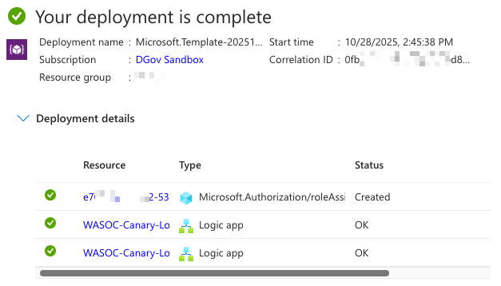

### Step 7.

Select the 'Logic app designer' under the 'Development Tools' and select the trigger action as shown below.

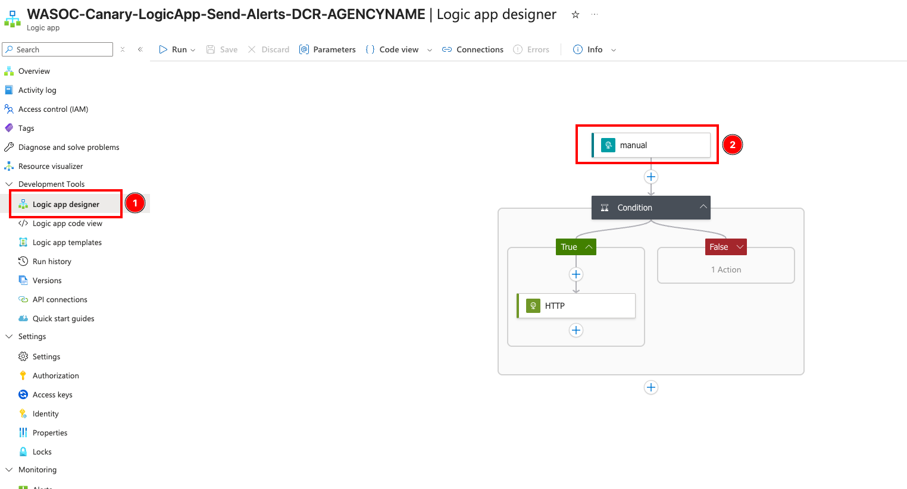

### Step 8.

From the trigger action parameters, copy the HTTP URL for the webhook.

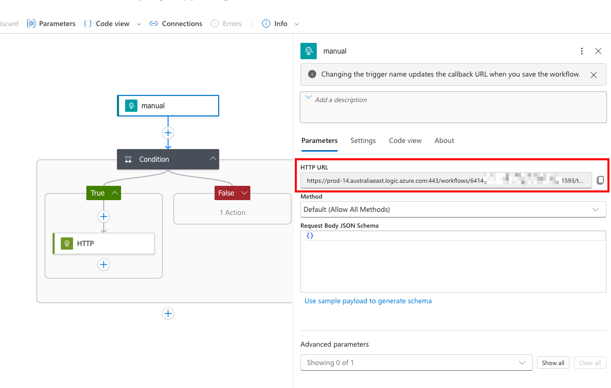

### Step 9.

In a new tab; navigate to the Honey Traps Canary platform and select the settings cogwheel at the top.

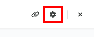

### Step 10. 

Go to 'Notifications' and select the '+' sign under 'Webhooks' to setup a new webhook for the logic apps. And then select 'Add Generic' option to add a generic webhook.

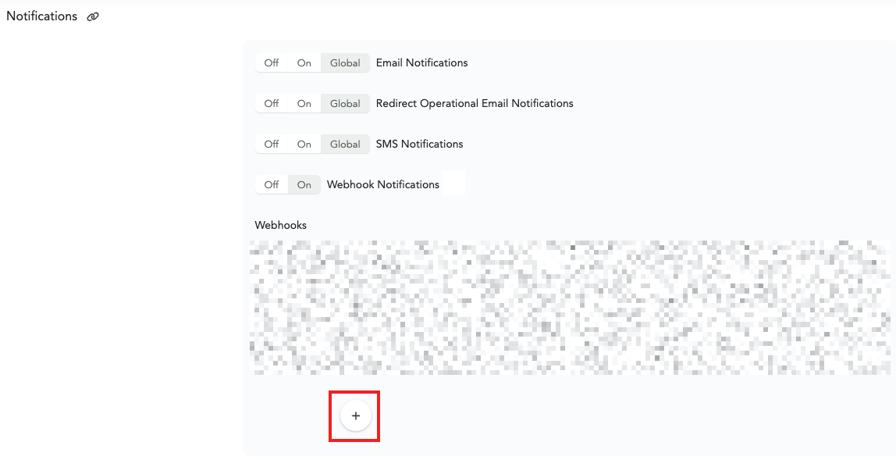

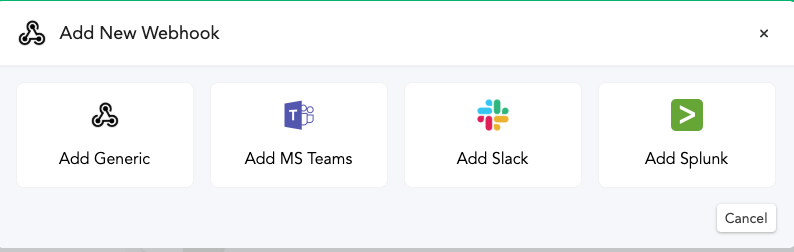

### Step 11.

1. Paste the HTTP URL that was copied from the Logic App in the step 8 under the 'Webhook URL' text field.
2. Turn on the 'Add custom request headers' option.
3. Enter ***'key'*** for the header name.
4. Copy-paste the key value from the 'Condition' action of Logic App. (Note: you have to go back to the ***Logic App*** and copy the ***guid*** value)

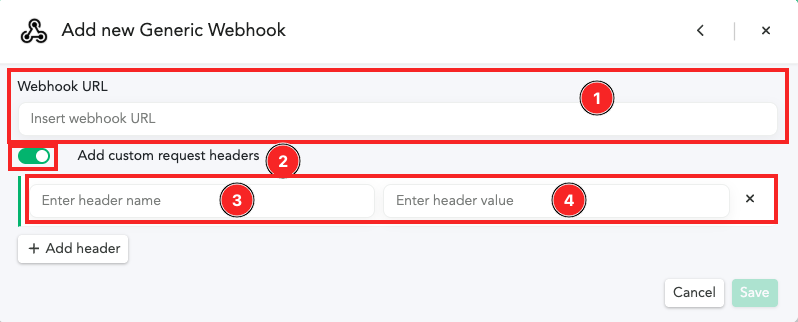

Finally, click on 'Save' button at the bottom to add the webhook to the Canary.

---

This completes the integration for the Honey Traps project. You can now create canary tokens and perform testing to ensure the integration is working correctly.

---

<!-- BEGINNING: Analytic Rules Deployment Guide -->
# Analytic Rules Deployment Guide

The following steps will guide you on deploying analytic-rules to generate alerts and incident in your Microsoft Sentinel workspace.

## Prerequisites

- You must have completed the [Honey Traps Canary Integration](#data-collection-rule-and-logic-app-deployment-guide) prior to deploying the analytic rules.
- You must have atleast one Canary token incident generated on the Canary platform.
- The analytic rule uses the following default table name in your Log Analytics Workspace: **Canary_CL**.

## Step by step guide

### Step 1.

To start the deployment of the Azure Analytic Rules for each type of canary, click on the 'Deploy to Azure' buttons shown below.

| Rule | Deploy |
|-|-|
| **Canary - Analytic Rules** |  | 
| **Threat Intelligence - Honey Traps - Suspicious Sign-in** |  | 

### Step 2.

You will be redirected to the custom deployment screen in azure portal. Select/ fill-in the required information

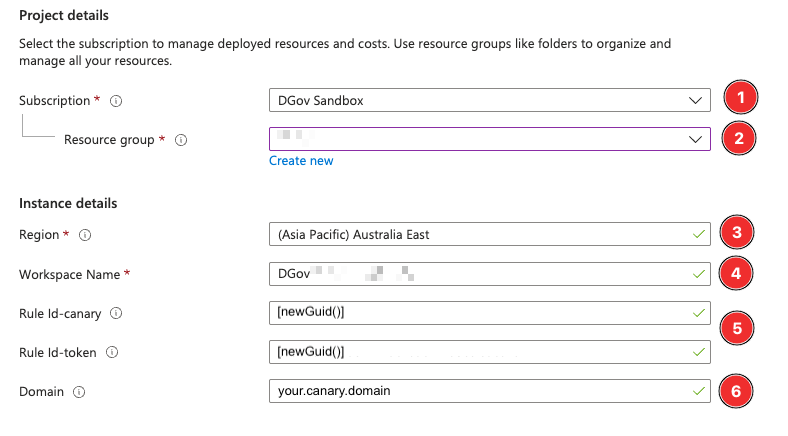

Field description:
1. **Subscription**: The subscriptions where the Sentinel workspace is located.
2. **Resource Group**: The resource group where the Sentinel workspace is located.
3. **Region**: The region where the Sentinel workspace is located.
4. **Workspace Name**: The _workspaceName_ of Sentinel log analytics workspace, where the analytic rule will be deployed to.
5. **Rule Id's**: Function value to obtain new Rule Id's for Canary and Canary Tokens.
6. **Domain**: The domain of the canary platform. e.g. '83ndg2ob.canary.tools'

{: .warning }
Do not replace or change the value in the 'Rule Id' fields. This is to generate unique Ids for your analytic rules.

### Step 3.
Review and ensure all details provided in the deployment are correct and proceed with creating the resources. Otherwise, select the 'previous' button to go back and make any changes.

### Step 4.
Navigate to _Analytics_ blade inside the Microsoft Sentinel, and verify that the analytics rules has been created and enabled.

### Step 5.
Initiate test to generate incident from the canary platform, and verify that incidents were generated in Microsoft Sentinel.
<!-- END: Analytic Rules Guide -->

## Initiating an end-to-end test
To initiate an end-to-end test the integration of the Honey Traps canary platform and the SIEM, you could do the following:

### Pre-requisites
- You must have a canary group provisioned by WA SOC.
- You must have completed the [DCR and Logic App deployment](#data-collection-rule-and-logic-app-deployment-guide) and have the [Analytic Rules Deployed](#analytic-rules-deployment-guide).

### Step 1. 
Create a new canary token within your canary group.

### Step 2. 
Trigger the canary token by interacting with it.

### Step 3. 
Navigate to your Log Analytics Workspace to check if any alerts have been ingested.

{: .note }
It may take up to 5 minutes for the alerts to be ingested for the first time.

If you have alerts being ingested into your Log Analytics Workspace, you have successfully completed your canary platform and SIEM integration. 

## Feedback
For questions or feedback, please contact cybersecurity@dpc.wa.gov.au

