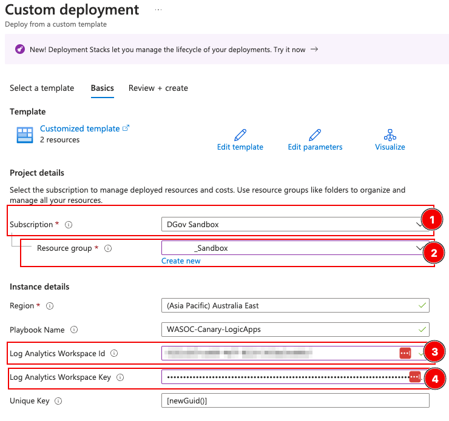

# About

This folder contains the Azure ARM templates to deploy logic-app resource(s) to send canary alerts from the console to the agency's Sentinel workspace. 

## Pre-requisites:
- Requires an Azure Log Analytics Workspace (to ingest the data from Canary platform)
- Required permissions to deploy the logic app and resources
- A Canary group that has been provisioned by WASOC

## Step by step guide

### Step 1. 
To start the deployment of the logic app to Azure, click on the Deploy to 'Azure button' shown below.

### Step 2.
You will be redirected to the custom deployment screen in azure portal. Select/ fill-in the required information.

Field description:
1. **Subscription**: The subscriptions where the Logic apps will be deployed to
2. **Resource Group**: The resource group where the Logic apps will be deployed to
3. **Log Analytics Workspace ID**: The _workspaceId_ of Sentinel log analytics workspace, where the canary/ canary-token logs will be send to
4. **Log Analytics Workspace Key**: The _primary key_ of the agent for Sentinel log analytics workspace, where the canary/ canary-token will be send to

> Note: Do not replace or change the value in the 'Unique Key' field as this will be used to generate a unique key for the webhook header.

Reference: 
- [Where is azure workspace Id and primary key](https://learn.microsoft.com/en-us/answers/questions/1154380/where-is-azure-is-the-primary-key-and-workspace-id)

### Step 3.
Review and ensure all details provided in the deployment are correct and proceed with creating the resources. Otherwise, select the 'previous' button to go back and make any changes.

### Step 4.
Navigate to your resource group from the deployment details page, and select your deployed Logic App (containing the name that you provided in the Step 2).

Your deployed Logic App under the Logic App designer, should look similar to the image shown below.

Capture the following information from your Logic App deployment for setting up a webhook with the Canary platform.

### Step 5.

1. Select the 'manual' action on the Logic App.
2. Copy/note down the value under the '**HTTP URL**' section, as shown below.

### Step 6.

1. Select the 'Condition' action from the Logic App.
2. Copy/note down the '**key**' value in the right side of the 'is equal to' condition. (***This is a GUID that is unique to you and will be used in setting up the webhook with the Canary platform***)

The two pieces of information noted in the previous steps 5 and 6 will be required to complete the setup of the webhook on the Canary platform side, which will allow you to start ingesting the alerts from the Canary platform to your Log Analytics Workspace.

### Step 7.

Navigate to your Canary platform's webhook settings and enter the two pieces of information we collected earlier as shown in the image below.

Field description:

1. Paste the URL from the logic app copied in the step 5.
2. Provide a header name and paste the GUID value copied in step 6.
3. Save the webhook information.

This completes the integration of your Canary platform with your SIEM environment.

## Feedback
For questions or feedback, please contact cybersecurity@dpc.wa.gov.au
